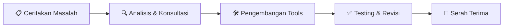

<!-- RexCode – GitHub README -->

<div align="center">

```
██████╗ ███████╗██╗  ██╗ ██████╗ ██████╗ ██████╗ ███████╗
██╔══██╗██╔════╝╚██╗██╔╝██╔════╝██╔═══██╗██╔══██╗██╔════╝
██████╔╝█████╗   ╚███╔╝ ██║     ██║   ██║██║  ██║█████╗  
██╔══██╗██╔══╝   ██╔██╗ ██║     ██║   ██║██║  ██║██╔══╝  
██║  ██║███████╗██╔╝ ██╗╚██████╗╚██████╔╝██████╔╝███████╗
╚═╝  ╚═╝╚══════╝╚═╝  ╚═╝ ╚═════╝ ╚═════╝ ╚═════╝ ╚══════╝
```

**Kerja manual yang melelahkan? Biar kode yang bereskan.**

[](mailto:)
[](/)
[](mailto:)

</div>

---

## 👋 Tentang RexCode

**RexCode** adalah jasa pembuatan tools & otomasi pekerjaan yang dirancang untuk membantu individu maupun tim mengoptimalkan rutinitas kerja mereka — lebih cepat, lebih efisien, tanpa harus paham coding.

Tidak ada solusi satu ukuran untuk semua. Setiap tools yang dibuat **disesuaikan penuh** dengan kebutuhan dan alur kerja kamu, bukan template instan.

> *"Ceritakan masalahmu — RexCode akan carikan solusinya."*

---

## 🛠️ Layanan

| Layanan | Deskripsi |
|---|---|
| ⚙️ **Otomasi Tugas Harian** | Input data, laporan rutin, rekapitulasi — semuanya bisa diotomasi |
| 🗂️ **Pengelolaan Data** | Sortir, filter, dan olah data dari spreadsheet, CSV, atau database |
| 🔗 **Integrasi Sistem** | Hubungkan aplikasi atau layanan yang kamu gunakan sehari-hari |
| 🛠️ **Tools Kustom** | Aplikasi kecil atau skrip sesuai alur kerja spesifik kamu |
| 🌐 **Scraping & Monitoring** | Kumpulkan data dari web atau pantau perubahan secara otomatis |
| 📊 **Dashboard & Laporan** | Visualisasi data dan laporan yang bisa langsung dipakai |

---

## 🏭 Bidang yang Dilayani

RexCode melayani berbagai bidang tanpa batasan industri:

```
✅ Bisnis & E-commerce         ✅ Keuangan & Akuntansi
✅ HR & Administrasi           ✅ Pendidikan
✅ Web & Aplikasi              ✅ Logistik & Operasional
✅ Riset & Analisis Data       ✅ Dan banyak lagi...

❌ Desain grafis               ❌ Hardware / firmware
```

---

## ⚡ Cara Kerja



1. **Konsultasi Gratis** — Ceritakan masalah atau alur kerja yang ingin dioptimalkan
2. **Analisis Kebutuhan** — RexCode menganalisis dan menawarkan solusi terbaik (bisa dari permintaanmu atau rekomendasi kami)
3. **Pengembangan** — Tools dibuat khusus sesuai kebutuhan, bukan template
4. **Serah Terima** — Tools siap pakai + penjelasan cara penggunaannya

---

## 💡 Kenapa RexCode?

- 🎯 **Solusi sesuai kebutuhan** — bukan template, bukan solusi generik
- 🤝 **Konsultasi aktif** — kami bantu identifikasi masalah yang mungkin belum kamu sadari
- ⚡ **Proses cepat** — fokus pada tools sederhana yang langsung bisa digunakan
- 🔄 **Fleksibel** — permintaan bisa datang dari kamu, atau kami yang suggestikan solusinya
- 📞 **Komunikasi terbuka** — update progres dan revisi sampai sesuai ekspektasi

---

## 📬 Hubungi RexCode

Punya pekerjaan manual yang ingin diotomasi? Atau tidak tahu harus mulai dari mana?

**Konsultasi gratis — tidak ada komitmen.**

<div align="center">

[](mailto:helpmeai969@gmail.com)
[](https://wa.me/+6285931230141)
[](https://linkedin.com/in/hisyammalik)

</div>

---

<div align="center">

*RexCode — Otomasi pekerjaan, bukan ganti pekerjaan.*

</div>
